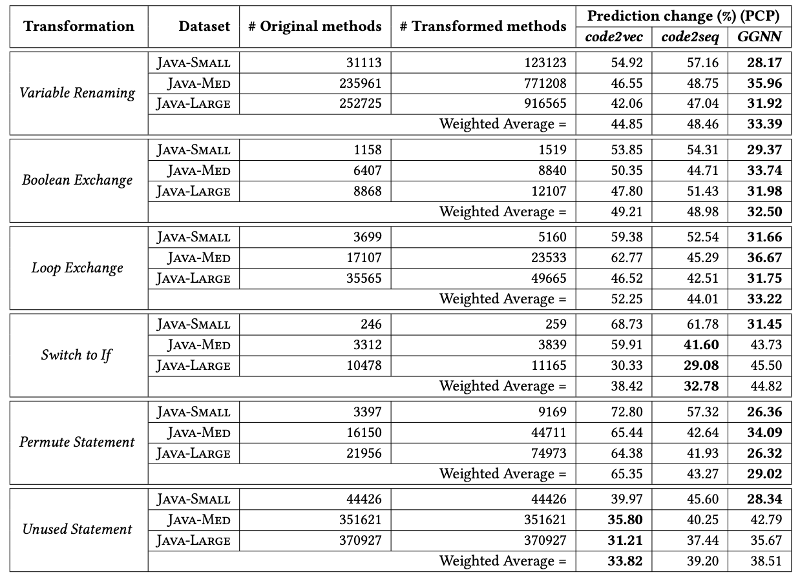

This folder contains the exact code and data used in the evaluation of our paper 'On the Generalizability of Neural Program Models with respect to Semantic-Preserving Program Transformations' ([arXiv](https://arxiv.org/abs/2008.01566), [ScienceDirect](https://doi.org/10.1016/j.infsof.2021.106552)).

---

## Motivating Example:

||
:-------------------------:
|Figure 1: A misprediction in [code2vec](https://github.com/tech-srl/code2vec) is revealed by renaming the `other` variable as `var0` in the **compareTo** method of the `java-small/test/hadoop/ApplicationAttemptId.java` file.|

---

## Semantic Program Transformations:

  * [Variable Renaming (VN)](https://github.com/mdrafiqulrabin/tnpa-framework#1-variable-renaming) - renames the name of a variable.
  * [Permute Statement (PS)](https://github.com/mdrafiqulrabin/tnpa-framework#5-permute-statement) - swaps two independent statements in a basic block.
  * [Unused Statement (UN)](https://github.com/mdrafiqulrabin/tnpa-framework#7-dead-code-insertion) - inserts an unused string declaration.
  * [Loop Exchange (LX)](https://github.com/mdrafiqulrabin/tnpa-framework#3-loop-exchange) - replaces `for` loops with `while` loops or vice versa.
  * [Switch to If (SF)](https://github.com/mdrafiqulrabin/tnpa-framework#4-switch-to-if) - replaces a `switch` statement with an equivalent `if` statements.
  * [Boolean Exchange (BX)](https://github.com/mdrafiqulrabin/tnpa-framework#2-boolean-exchange) - switches the value of a `boolean` variable and propagates this change in the method.

---

## Program Transformation Tool:

Create the jar file ([JavaMethodTransformer.jar](https://github.com/mdrafiqulrabin/tnpa-generalizability/tree/master/NPM-IST21/JavaMethodTransformer)) using `Maven` and then call the jar with the following arguments:

  * args[0] = Input directory to the original methods.
  * args[1] = Output directory to the transformed methods.

  ```
  $ cd <.../JavaMethodTransformer/>
  $ mvn clean compile assembly:single
  $ java -jar target/jar/JavaMethodTransformer.jar <.../methods/> <.../transforms/>
  ```

## Datasets of Transformed Methods:

  * [single-place](https://uh.edu/serg/data/artifacts/tnpa-generalizability/transformed_methods/single-place.zip) - apply the transformation to each candidate location separately.
  * [all-place](https://uh.edu/serg/data/artifacts/tnpa-generalizability/transformed_methods/all-place.zip) - apply the transformation to all candidate locations simultaneously.
  * [x-percent](https://uh.edu/serg/data/artifacts/tnpa-generalizability/transformed_methods/x-percent.zip) - apply the transformation to randomly selected X\% candidate locations, where X = [25, 50, 75].

---

## Generalizability Metrics:

  * Prediction Change Percentage (PCP):
  
    The percentage of changes in predictions before the transformation and after the transformation.
    
    Type of Changes:
    * CCP  - the percentage of correct predictions that stay correct.
    * CWP  - the percentage of correct predictions that become wrong.
    * WWSP - the percentage of wrong predictions that stay to the same wrong prediction.
    * WCP  - the percentage of wrong predictions that become correct.
    * WWDP - the percentage of wrong predictions that change to a different wrong prediction.

  * Sub-token Comparison:
    * Precision - the percentage of predicted sub-tokens that are true positives.
    * Recall    - the percentage of true positive sub-tokens that are correctly predicted.
    * F1-Score  - the harmonic mean of precision (P) and recall (R).

---

## Experimental Setting:

  * Target Downstream Task:
    * Method Name Prediction (a.k.a. [Extreme Code Summarization](https://arxiv.org/abs/1602.03001)) 

  * Subject Neural Program Models:
    * [code2vec model](https://github.com/tech-srl/code2vec/) - represents programs with AST paths (monolithic path embeddings).
    * [code2seq model](https://github.com/tech-srl/code2seq/) - represents programs with AST paths (encode paths node-by-node).
    * [GGNN model](https://github.com/bdqnghi/ggnn.method_name_prediction/) - represents programs with graphs (semantic edges + nodes).

  * Original Java Datasets:
    * [Java-Small, Java-Med, and Java-Large](https://github.com/tech-srl/code2seq/#java)

---

## Prediction Change (%):

||
:-------------------------:
|Table 2: Prediction Change Percentage (PCP) across all models, datasets, and transformations.|

---

## Related Articles:

- Testing Neural Program Analyzers [[arXiv](https://arxiv.org/abs/1908.10711), [GitHub](https://github.com/mdrafiqulrabin/tnpa-framework)]
- Evaluation of Generalizability of Neural Program Analyzers [[arXiv](https://arxiv.org/abs/2004.07313), [GitHub](https://github.com/mdrafiqulrabin/tnpa-evaluation)]
