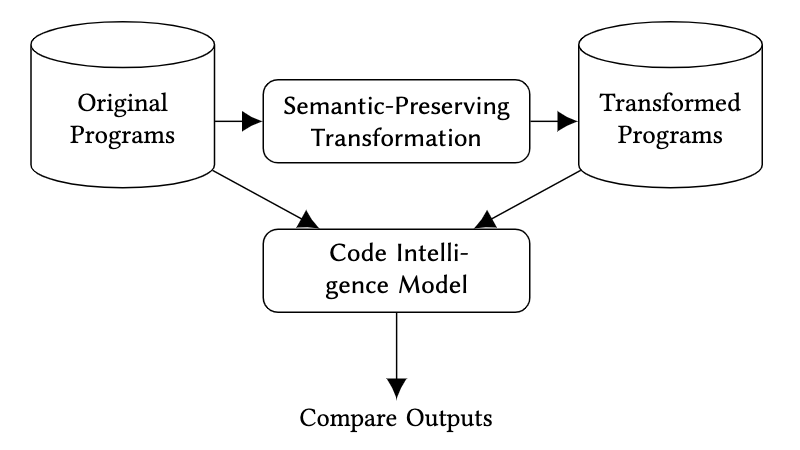

## Semantic-Preserving Program Transformations

This project contains the program transformation tool and the datasets of transformed programs for the paper 'On the Generalizability of Neural Program Models with respect to Semantic-Preserving Program Transformations' ([arXiv](https://arxiv.org/abs/2008.01566), [ScienceDirect](https://doi.org/10.1016/j.infsof.2021.106552)) accepted at the [IST Journal, Elsevier 2021](https://www.journals.elsevier.com/information-and-software-technology) and presented at the [SANER-JFT 2022](https://saner2022.uom.gr/journalFirstTrack).

---

## Structure

```
├── NPM-IST21                 # artifact of our paper.
  ├── JavaMethodExtractor     # code for extracting single java methods.
  ├── JavaMethodTransformer   # code for semantic program transformations.
  ├── images                  # some figures used in the paper.
  ├── results                 # data and plots used in the paper.
``` 

---

## Approach

||
:-------------------------:
|The workflow of our generalizability evaluation.|

---

# Citation:

[On the Generalizability of Neural Program Models with respect to Semantic-Preserving Program Transformations](https://doi.org/10.1016/j.infsof.2021.106552)

```
@article{rabin2021generalizability,
  title = {On the generalizability of Neural Program Models with respect to semantic-preserving program transformations},
  author = {Md Rafiqul Islam Rabin and Nghi D.Q. Bui and Ke Wang and Yijun Yu and Lingxiao Jiang and Mohammad Amin Alipour},
  journal = {Information and Software Technology (IST)},
  volume = {135},
  pages = {106552},
  year = {2021},
  issn = {0950-5849},
  doi = {https://doi.org/10.1016/j.infsof.2021.106552},
  url = {https://www.sciencedirect.com/science/article/pii/S0950584921000379}
}
```

---

### <ins>Updated Program Transformation Tools</ins>:
<ul>
  <li> JavaMethodTransformer: https://github.com/mdrafiqulrabin/JavaTransformer </li>
  <li> CSharpMethodTransformer: https://github.com/mdrafiqulrabin/CSharpTransformer </li>
</ul>
